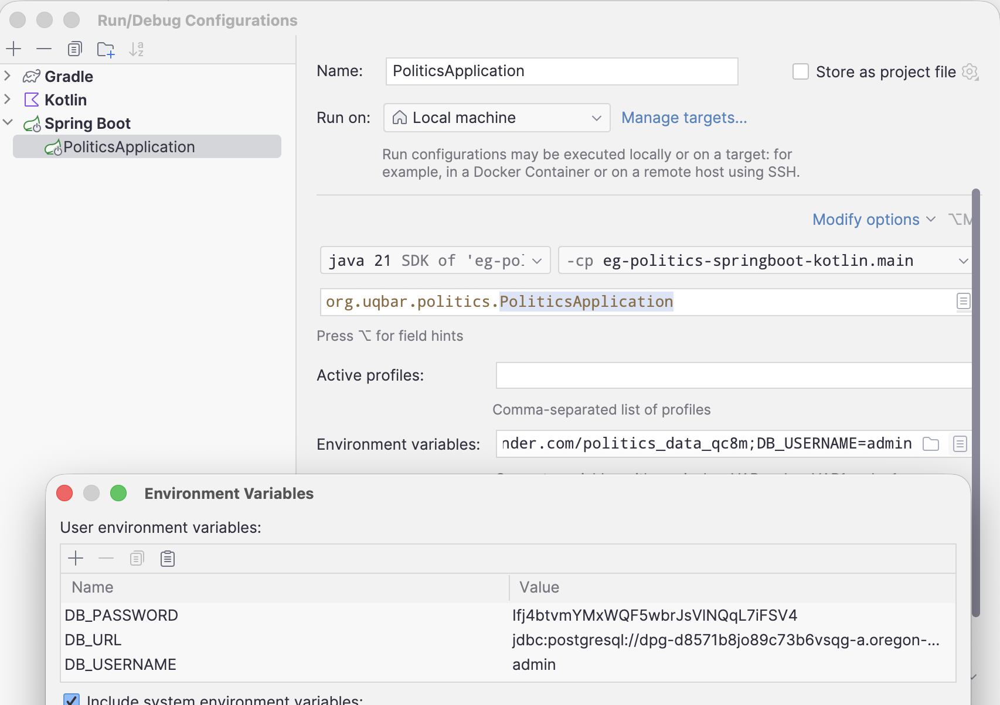

## Para la clase de deploy

### README

En el README.md hay que agregar 

El material para seguir la clase está en [estas diapositivas](https://docs.google.com/presentation/d/1wW42bS2xW5eBWNs-Jasg8WU-qeET4uPRIRS2cnki9Rw/edit?slide=id.p#slide=id.p).

### Conexión a la base

Reemplazamos la configuración en `application.yml`:

```yml
spring:
  datasource:
    url: ${DB_URL}
    username: ${DB_USERNAME}
    password: ${DB_PASSWORD}
```

y le pasamos en `Edit Configuration` la lista de valores. Primero `Modify options` > `Environment variables` y le pasamos la información de Render:



