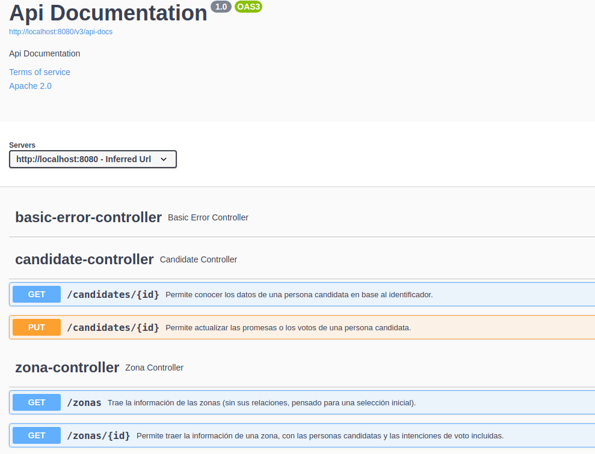

# Spring Boot - Politics - Mapeo OR/M

[](https://github.com/uqbar-project/eg-politics-springboot/actions/workflows/build.yml) [](https://codecov.io/gh/uqbar-project/eg-politics-springboot-kotlin)

## Material relacionado

- [Apunte con la explicación completa](https://docs.google.com/document/d/13vAmPKbWfWpRWze3AhLwnCHfWktfIIXnju3PD_tzyW4/edit)

## Swagger - Open API

Un chiche interesante es que pueden explorar y testear con Swagger el presente ejemplo, levantando la aplicación y navegando en la siguiente URL:

http://localhost:8080/swagger-ui/index.html#/

[Swagger](https://swagger.io/) busca los controllers y arma un entorno web para probar los endpoints (puede resultar más cómodo que POSTMAN sobre todo para métodos POST o PUT).

Para conseguir el mismo efecto en tu proyecto solo tenés que agregar dos dependencias:

```xml
<dependency>
  <groupId>io.springfox</groupId>
  <artifactId>springfox-boot-starter</artifactId>
  <version>3.0.0</version>
</dependency>
<dependency>
  <groupId>io.springfox</groupId>
  <artifactId>springfox-swagger-ui</artifactId>
  <version>3.0.0</version>
</dependency>
```

Luego en los controllers la annotation `@ApiOperation` es la que permite agregar una descripción al endpoint

```xtend
@GetMapping(value="/zonas/{id}")
@ApiOperation("Permite traer la información de una zona, con las personas candidatas y las intenciones de voto incluidas.")
def getZona(@PathVariable Long id) {
```

que luego tomará Swagger para publicar en la página.



## Testeo de integración

Podés ver la implementación de varios casos de prueba:

- para el controller de zonas
    - al traer todas las zonas no trae las personas candidatas
    - al traer una zona trae todas las personas candidatas (para este caso de prueba necesitamos convertir el JSON a una clase DTO especial para el test, ya que la serialización se hace con una clase ZonaParaGrillaSerializer en lugar de manejar el mapeo con anotaciones de Jackson o un DTO, quizás una razón más para utilizar como técnica el DTO)
    - si buscamos una zona inexistente debe devolver código de http 404
- para el controller de candidates
    - si actualizamos un candidate mediante un PUT eso se refleja en la base de datos. Dado que tiene efecto colateral **debemos utilizar la anotación @Transactional para este test**. Si bien utilizamos una base de datos in-memory y podríamos pensar "los cambios realmente no persisten", sí lo hacen en el contexto de los tests. Es decir, si repetimos el mismo test sin revertir el cambio, el primer test pasará correctamente **y el segundo fallará cuando espere que nuestro candidate tenga 0 votos**.
  